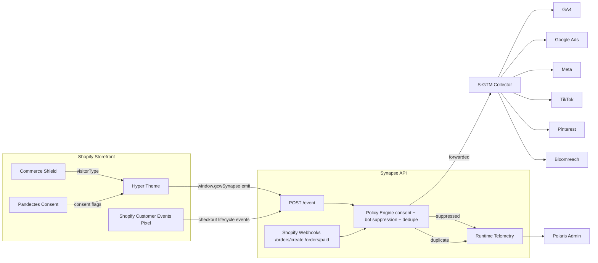

# GCW Synapse V1 Production Build

## 1) Architecture Diagram



## 2) Production File Tree

```text
GCW-Synapse-main/
  apps/
    admin/
      src/
        App.tsx
        api.ts
        main.tsx
  extensions/
    theme-app-extension/
      assets/gcw-synapse.js
      blocks/gcw-synapse-app-block.liquid
    customer-events-pixel/
      gcw-synapse-customer-events.js
  src/
    server.ts
    services/
      runtimeEvents.ts
      runtimeEventPolicy.ts
      gtmForwarder.ts
      metrics.ts
    types/
      synapse.ts
```

## 3) Database Schema

Synapse runtime telemetry currently runs in-memory for sub-20ms response time.
Use this schema for production persistence in Postgres.

```sql
create table synapse_runtime_events (
  id bigserial primary key,
  created_at timestamptz not null default now(),
  event_name text not null,
  event_id text,
  source text not null,
  status text not null check (status in ('forwarded','suppressed','duplicate')),
  reason text,
  visitor_type text,
  payload jsonb not null
);

create index idx_synapse_runtime_events_created_at on synapse_runtime_events (created_at desc);
create index idx_synapse_runtime_events_event_id on synapse_runtime_events (event_id);
create index idx_synapse_runtime_events_status on synapse_runtime_events (status);
```

## 4) GTM Dependency Coverage

Inputs reviewed:
- GTM-TKW58K8 workspace 197 export
- gcw_synapse_dependency_matrix.csv

Validated coverage:
- Active matrix rows: 184
- Active tags: 51
- Active variables: 70
- Missing GTM tags vs active matrix: 0
- Missing GTM variables vs active matrix: 0

Implementation rule:
- Synapse emits only active matrix-required fields and required objects/events.
- No generic Elevar payload cloning.

## 5) Data Layer Specification (window.gcwSynapse)

Required object keys emitted in every runtime event:
- customer
- product
- collection
- cart
- checkout
- marketing
- session
- consent

Required event names:
- page_view
- view_item
- view_item_list
- view_search_results
- add_to_cart
- remove_from_cart
- view_cart
- begin_checkout
- add_shipping_info
- add_payment_info
- purchase
- sign_up
- login
- newsletter_signup

Policy gates:
- Suppress confirmed bots via visitor_type in Commerce Shield classification.
- Require analytics_storage=granted for all event forwarding.
- Require ad_storage/ad_user_data/ad_personalization=granted for marketing events.
- Dedupe window: 5 minutes by event_name + event_id/session_id.

## 6) GTM Migration Plan

1. Keep current GTM container and all existing tag IDs.
2. Enable Synapse runtime ingestion in shadow mode for storefront events.
3. Mirror key Elevar baseline to /compare/elevar for parity checks.
4. Validate in /compare/parity and /runtime/summary until mismatch and suppression rates stabilize.
5. Cut over by removing Elevar script injection while preserving GTM tags/triggers.
6. Keep Triple Whale untouched.
7. Monitor /runtime/recent, /compare/channels, and launch readiness gate.

## 7) Smoke Test Plan

1. Page load on PDP should emit page_view and view_item where applicable.
2. Hyper quick add should emit add_to_cart with event_id.
3. Cart drawer open should emit view_cart.
4. Checkout started/shipping/payment/customer events pixel should emit begin_checkout/add_shipping_info/add_payment_info.
5. Checkout complete should emit purchase with order_id/revenue.
6. With denied marketing consent, marketing events should be suppressed.
7. With confirmed bot visitor_type, marketing events should be suppressed.
8. Replaying the same event_id within 5 minutes should return duplicate_ignored.

## 8) Rollback Plan

1. Disable theme app block GCW Synapse.
2. Disable customer events pixel script for Synapse.
3. Keep webhook relay active for purchase continuity.
4. Restore Elevar theme injection and customer events app pixel.
5. Validate conversion parity in GTM debug mode.

## 9) Production Deployment Plan

1. Deploy API build to production host.
2. Configure env values:
   - GTM_SERVER_URL
   - SHOPIFY_WEBHOOK_SECRET
   - INGRESS_SHARED_TOKEN
   - GA4_MEASUREMENT_ID and shop overrides
3. Register webhook endpoints for orders/create and orders/paid.
4. Deploy theme extension assets and app block.
5. Publish customer events pixel script with endpoint + token.
6. Run smoke tests and monitor runtime summary for first 48 hours.
7. Move from shadow compare to full forward mode after parity pass.
